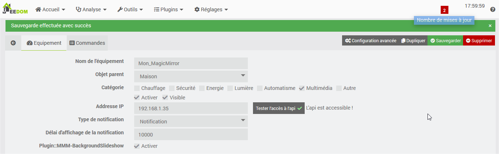

### Plugin MagicMirror² by Da3o55

## C'est quoi MagicMirror² ?

C'est un developpement opensource permettant des projet DIY de type mirror magic.
Pour plus d'information : [MagicMirror²](https://magicmirror.builders/)

De nombreux modules permettrant d'étentre les fonctionnalités existent.
[Modules pour MagicMirror²](https://github.com/MichMich/MagicMirror/wiki/3rd-party-modules)

## Pré-requis

Pour utiliser ce plugin sous jeedom vous devez disposer d'au moins un objet connecté de type MagicMirror².
Il vous faudra également avoir installé, configuré et vérifié le bon fonctionne du plugin MMM-Remote-Control.

Cette documentation ne traite en aucun le périmettre du MagicMirror² !

## Intallation du plugin

Le plugin est pour le moment en béta, il faudra donc activer la possibilité d'installer ces versions sur votre Jeedom.
Pour cela la document de jeedom est disponible.

## Configuration

Pas de configuration particulière pour ce plugin.

## Ajout d'un nouveau MagicMirror²

Cliques sur "Ajouter", puis saisis le nom de ton objet

Une fois l'objet créé, configuré celui-ci.

Dans un premier temps tu retrouveras les élements classiques d'un objet Jeedom.
- Son nom
- L'oject parent
- Catégorie
- Activation/Désactivation  & Visible/Invisible

Ensuite, les élements de configuration spécifique à ce MagicMirror².
- Son adresse IP et le boutton pour tester l'accès  l'api
- Le type de notification souhaité vers ce MagicMirror²
- Le délai d'affchichage de la notification.
- L'activation/désactivation de la prise en charge du module MMM-BackgroundSlideshow

Pour pouvoir sauvegarder votre objet, il faudra obligatoirement, l'ip, avoir testé avec succès la disponibilité de l'api, le délai de la notification.

## Les commandes

- **Eteindre** : Exécute un arrêt de l'équipement (shutdown)

- **Redémarer** : Redémarer l'équippement (reboot)

- **Remote.html** : Ouvre la page de menu du module MMM-Remote-Control installé sur le MagicMirror²

- **Rafrachir HTML** : Recharge la page d'afficage du MagicMirror².

- **Recharger** : Recharge le programme MagicMirror² sur l'équipement distant.

- **Rafraichir** : Rafraichit l'affichage et les données de la tuile jeedom de l'équipement.

- **Statut** : Affiche le statut global de l'équipement (get http)

- **Affichage** : Statut de l'affichage de l'équipement distant.

- **Masquer laffichage** : Afficher ou Masquer l'affichage distant.

- **Notification** : Envoie une notification vers l'équipement, ALERT ou NOTIFICATION en fonction de la configuration de votre objet dans Jeedom.

- **Fond décran** : Statut du fond d'écran de l'équipement distant.

- **Masquer fond décran** : Afficher ou Masquer le fond d'écran sur l'équipement distant.

## Exemple d'utilisation dans un scénario

Bientôt...

## Problème(s) connu(s)

# Restart fail

Côté MagicMirror² :
>cd ~/MagicMirror/modules/MMM-Remote-Control
>npm link pm2

